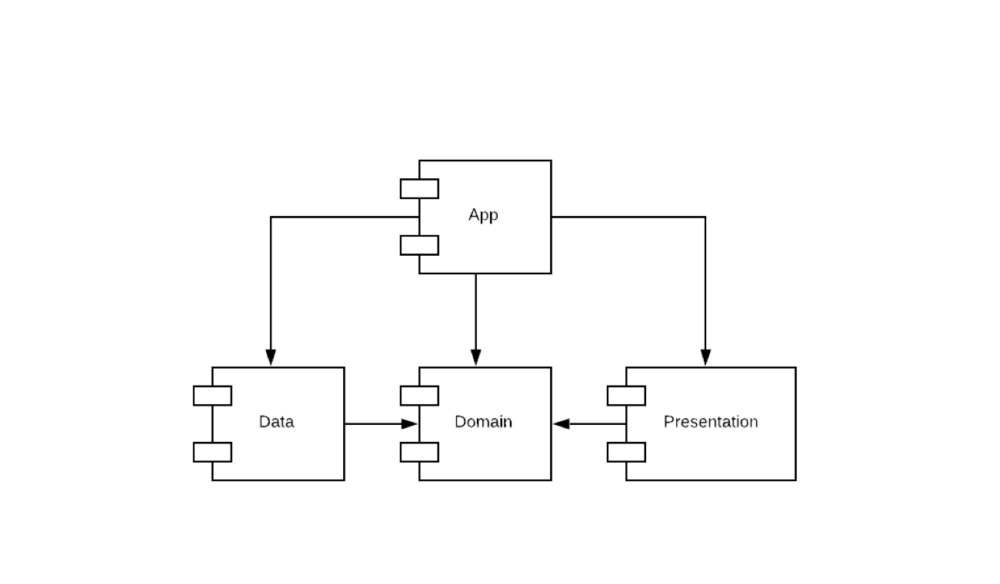

# Android style guide

 - [Package structure](#package-structure)
 - [Syntax](#syntax)
 - [Naming](#naming)
 - [Constants](#constants)
 - [If statements](#if-statements)


## Modules And Packages Structure

Following clean architecture guidelines our projects are split into three separate modules: Domain, Data, Presentation and App




### App module package structure
App module is the main application module. It must contain only your `Application` class and `Dagger` files to provide dependencies injection for the whole application

> Note all packages are in lower case


- dk.company.appname.app
  - initlizers
    - AppInitlizer.kt
  - injection
    - components
    - modules
      - AppModule.kt
      - InteractorModule.kt
      - RestModule.kt
      - RepositoryModule.kt
  - App.kt


### Presentation module package structure
Presentation module contains all ui-related logic: Fragments, ViewModels, Custom views and etc.
 - dk.company.appname.presentations
    - base
    - nstack
      - Translation.java
      - RateReminderActions.kt
    - extensions
      - ContextExtensions.kt
      - ViewExtensions.kt
    - ui
        - shared
            - AppDialog.kt
        - login
            - LoginFragment.kt
            - LoginViewModel.kt
            - LoginViewState.kt
        - signup
        - splash
        - main
             - MainActivity.kt
             - MainViewModel.kt
             - MainViewState.kt
    - util


### Domain Module Package Structure
Domain module contains Repository interfaces, Interactors and Entities that used by them
- dk.company.appname.domain
    - extensions
    - managers
    - repository
      - UserRepository.kt
      - PostsRepository.kt
    - interactors
      - Interactor.kt
      - GetPostsInteractor.kt
    - models
      - User.kt
      - Post.kt

### Data Module Package Structure
Data module contains repository implementations and local/remote data sources
- dk.company.appname.data
  - repository
    - UserRepositoryImpl.kt
    - PostsRepositoryImpl.kt
  - database
  - network

## Activity/Fragment Class structure

### Fields

 - Order your fields and group them together and have all the fields at the top of the class.
 - Try to have some logic around the order of your methods
 - When subscribing for a  `LiveData`'s state try splitting rendering of these properties into separate functions


```kotlin
class SomethingFragment {

  private val viewModel: SomethingViewModel by viewModel()
  private val args: SomethingFragmentArgs by navArgs()

  override fun onActivityCreated(savedInstanceState: Bundle?) {
    viewModel.viewState.observeNonNull(this) { state ->
         showLoading(state)
         showPosts(state)
         showErrorMessage(state)
     }
 }

 private fun showPosts(state: SampleViewState) {
   // Show Posts
 }

 private fun showLoading(state: SampleViewState) {
   // Show Loading state}

 private fun showErrorMessage(state: SampleViewState) {
    // Handle error dialog
  }
}
```

## Syntax

### Paranthesis & Brackets
The curly braces around a body can be omitted if the body is a oneliner. This is discouraged unless the body goes on the same line as the condition


<table width="100%">
<tr>
    <th>Do</th>
    <th>Don't</th>
  </tr>
<tr>
<td>

```kotlin
// OK
if (something) doSomething()
```

```kotlin
// OK
if (something) {
  doSomething()
}
```


</td>
<td>

```kotlin
// Not allowed
if (something)
  doSomething()
```


</td>
</tr>
<tr>
<td>

```kotlin
// OK
val result = if (something) doSomething() else defaultValue
```

```kotlin
// OK
val result = if (condition) {
    0
} else {
    1
}
```

</td>
<td>

```kotlin
// Not Allowed!
val result = if (conditionA)
                0
            else
                1
```


</td>
</tr>
</table>


### Comments


<table width="100%">
<tr>
    <th>Do</th>
    <th>Don't</th>
  </tr>
<tr>
<td>

```kotlin
// Something important
val x = y ?: default
```

</td>
<td>

```kotlin
//something important
val x = y ?: default
```

</td>
</tr>
<tr>
<td>

```kotlin
/*
  Something important
*/
fun someComplexMethod() {
  ...
}
```


</td>
<td>


```kotlin
/*somthing important*/
fun someComplexMethod() {
  ...
}
```


</td>
</tr>

</table>


## Naming

### XML

*View Ids*

After Kotlin introduced the extensions that autogenerates view bindings, naming conventions of xml elements is even more important.

The format is _layout_ _name_ _viewtype_ ~ `loginPasswordEt` or put another way, think of it as nstack with section-Key-ViewType

**File names**

- `item_name` *Adapter views for listviews/recyclerviews*
 - `fragment_name`  *Fragment views*
 - `include_name`  *Include layouts, try to add some context here as well i.e. include_main_toolbar or* `include_list_item_something_header`
 - `activity_name`  *Activity views*
 - `dialog_name` *Dialogs*
 - `view_name` *Custom views layouts`


### Classes

 - Repositories can either be name `SomethingRepository`
 - Interactors are in the format `SomethingInteractor`
 - Activities/Fragments are named `SomethingFragment` / `SomethingActivity`
 - Views/Layouts are `SomethingView` / `SomethingLayout`

## Constants

### Environment keys/constants

Keys or constants that change depending on environment / flavor should be put in the `build.gradle` file.

That means you can use `BuildConfig.KEY` in your code instead of i.e. `Constants.KEY`. The build system can then change to the correct set of keys depending on what environment you build towards.

Example:
```groovy
buildConfigField "String", "API_URL", "\"https://test.site.dk/api/\""
buildConfigField "String", "HOCKEY_ID", "\"123412341234\""
buildConfigField "int", "SOME_ENV_SPECIFIC_ID", "1"
buildConfigField "boolean", "API_ENV_VAR", "false"
```

```kotlin
Retrofit retrofit = Retrofit.Builder()
    .baseUrl(BuildConfig.API_URL)
    ...
    .client(client)
    .build()

    return retrofit.create(BackendService.class)
```

#### Constants that doesn't change

<table width="100%">
<tr>
    <th>Do</th>
    <th>Don't</th>
  </tr>
<tr>
<td>

```kotlin
object ArgumentKeys {
  const val LOGIN_USER = "LOGIN_USER"
}
object DefaultValues {
  const val ITEM_CNT = 30
}

```

</td>
<td>

Use one giant `Constants.kt`
```kotlin
 object Constants {
   const val DEFAULT_ITEM_CNT = 30
   const val ARG_ITEM_ID = "itemId"
   ...
 }
```

</td>
</tr>

</table>


## Scope functions
Kotlin provides various scope functions that allows to  execute a block of code within the context of an object. To help you choose the right scope function for your purpose, you can use this table that highlights differences between them.


| Function 	| Object Reference 	| Return Value   	| Is extension function                       	|
|:--------:	|:----------------:	|----------------	|---------------------------------------------	|
| `let`      	| it               	| Lambda result  	| Yes                                         	|
| `run`      	| this             	| Lambda result  	| Yes                                         	|
| `run`      	| -                	| Lambda result  	| No: called without the context object       	|
| `with`     	| this             	| Lambda result  	| No: takes the context object as an argument 	|
| `apply`    	| this             	| Context object 	| Yes                                         	|
| `also`     	| it               	| Context object 	| Yes                                         	|


Here is a short guide for choosing scope functions depending on the intended purpose:

- Executing a lambda on non-null objects: `let`
- Introducing an expression as a variable in local scope: `let`
- Object configuration: `apply`
- Object configuration and computing the result: `run`
- Running statements where an expression is required: **non-extension** `run`
- Additional effects: `also`
- Grouping function calls on an object: `with`


# If statements

### Minimize logic in ifs

Try to boil down `if` statements. If you have many expressions, consider changing them to boolean local variables:

<table width="100%">
<tr>
    <th>Do</th>
    <th>Don't</th>
  </tr>
<tr>
<td>

```kotlin
// Better
val isYounger = repo.get(id).getAge() < repo.get(otherId).getAge()
val existsInList = otherRepo.getItems().contains(id)
val isStateX = SomethingManager.getSomeState() == SomeState.X

if(isYounger && existsInList && isStateX) {
    ...
}
```

</td>
<td>

```kotlin
// Hard to read
if(repo.get(id).getAge() < repo.get(otherId).getAge()
 && otherRepo.getItems().contains(id)
 && SomethingManager.getSomeState() == SomeState.X) {
    ...
}
```

</td>
</tr>

</table>


## if vs. when

Use `if` for binary checks. When there are more then two options consider using `when` instead

<table width="100%">
<tr>
    <th>Do</th>
    <th>Don't</th>
  </tr>
<tr>
<td>

  ```kotlin
  if(condtion) {
    doSomething()
  } else {
    doSomethingElse()
  }
  ```

</td>
<td>

  ```kotlin
  when(condtion) {
    true -> doSomething()
    false -> doSomethingElse()
  }
  ```

</td>
</tr>
<tr>
<td>

```kotlin
when (size) {
  1 -> doSomething()
  in 1..10 -> doIfConditionB()
  else -> doSomethingElse()
}
```

</td>
<td>


  ```kotlin
  if (size == 1) {
    doSomething()
  } else if (size <= 10 && size > 1) {
     doIfConditionB()
  } else {
    doSomethingElse()
  }
  ```

</td>
</tr>
</table>

### Avoid nested ifs

Following logic in a deeply nested if else mess can be hard and error prone for the next developer. There are several ways of avoiding that.

Consider inverting the expression and returning:
<table width="100%">
<tr>
    <th>Do</th>
    <th>Don't</th>
  </tr>
<tr>
<td>


```kotlin
// Better
val follower = item?.getFollowers()?.find { it.id == someId } ?: return
// do stuff with follower
```

</td>
<td>

```kotlin
// Hard to follow
if (item != null) {
   if (item.getFollowers() != null && item.getFollowers().get(someId) != null) {
       follower = item.getFollowers().get(someId)
     	 // do stuff with follower
   }
}
```

</td>
</tr>

</table>


## Extension Files

- Do not place all the extensions in one giant `Extension.kt` file, instead split it based on what you're extending i.e `ContextExtenstions`, `ViewExtensions`, `ModelsExtensions` and e.t.c. As the file getting bigger and bigger, consider how else it can be split into logical parts.
- To minimize API pollution, restrict the visibility of extension functions as much as it makes sense
- When defining extension functions that make sense only for a specific client, put them next to the code of that client.
- As necessary, use local extension functions, member extension functions, or top-level extension functions with private visibility.


## See also

- [Kotlin Language Coding Convetions](https://kotlinlang.org/docs/reference/coding-conventions.html)
- [Android - Kotling Style guide](https://developer.android.com/kotlin/style-guide)
